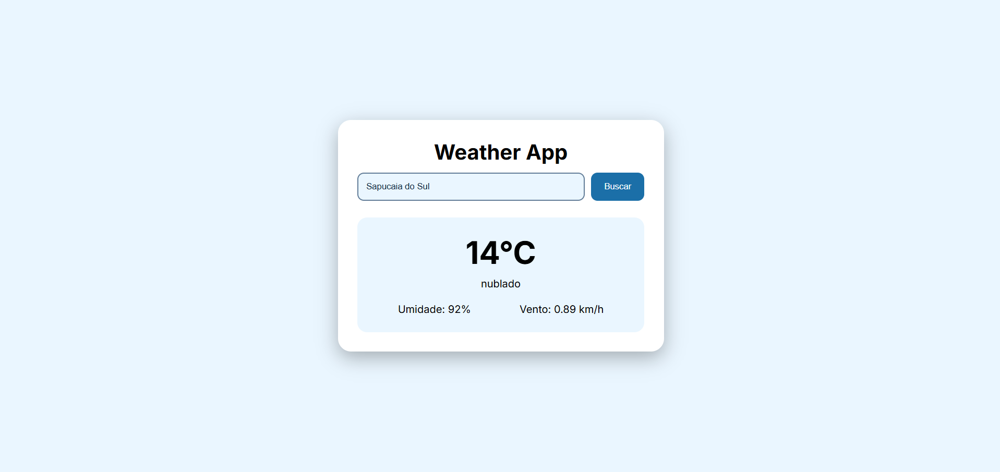

# Weather App

Aplicação desenvolvida com HTML5, CSS3 e JavaScript puro como parte da minha trilha de estudos em Desenvolvimento Frontend.

O objetivo deste projeto foi construir uma aplicação capaz de consumir uma API externa para consultar informações climáticas em tempo real, reforçando conceitos de consumo de APIs, programação assíncrona e manipulação do DOM.



## Sobre o Projeto

O Weather App permite que o usuário pesquise o clima de qualquer cidade utilizando a API da OpenWeatherMap.

Durante o desenvolvimento, foram aplicados conceitos fundamentais de JavaScript moderno, como `fetch()`, `async/await` e manipulação dinâmica da interface, aproximando o projeto de cenários encontrados no mercado de desenvolvimento Frontend.

## Funcionalidades

- Buscar clima de qualquer cidade
- Exibir temperatura atual
- Exibir condição climática
- Exibir umidade do ar
- Exibir velocidade do vento
- Interface moderna e responsiva
- Atualização dinâmica dos dados sem recarregar a página
- Estrutura preparada para futuras melhorias

## Tecnologias Utilizadas

- HTML5
- CSS3
- JavaScript (Vanilla JS)
- Fetch API
- Async/Await
- OpenWeatherMap API
- Flexbox
- CSS Variables
- Google Fonts (Inter)
- Media Queries
- Git
- GitHub

## Estrutura do Projeto

```text
weather-app/

├── index.html
│
├── css/
│   └── style.css
│
├── js/
│   └── script.js
│
├── images/
│   └── preview.png
│
└── README.md
```

## Conceitos Praticados

### HTML

- Estrutura semântica
- Inputs
- Botões
- Containers reutilizáveis

### CSS

- Reset CSS
- Variáveis CSS
- Flexbox
- Componentização visual
- Responsividade
- Hover Effects
- Media Queries

### JavaScript

- Manipulação do DOM
- `document.getElementById()`
- `addEventListener()`
- Funções assíncronas (`async`)
- `await`
- `fetch()`
- Consumo de APIs REST
- Tratamento de dados JSON
- Atualização dinâmica da interface

## API Utilizada

Este projeto utiliza a API pública da OpenWeatherMap para consultar informações meteorológicas em tempo real.

https://openweathermap.org/api

## Aprendizados

Este projeto consolidou conhecimentos essenciais para qualquer desenvolvedor Frontend moderno, principalmente na comunicação entre aplicações e serviços externos.

Durante o desenvolvimento foram praticados conceitos como:

- Consumo de APIs REST
- Programação assíncrona
- Atualização dinâmica do conteúdo da página
- Manipulação de objetos JSON
- Organização de código JavaScript
- Estruturação de interfaces responsivas

## Melhorias Futuras

As próximas versões poderão incluir:

- Ícones dinâmicos conforme a condição climática
- Campo de pesquisa com tecla Enter
- Histórico das últimas pesquisas
- Mensagem de carregamento durante a consulta
- Tratamento visual para erros
- Geolocalização automática do usuário
- Alternância entre tema claro e escuro
- Previsão do tempo para os próximos dias

## Como Executar o Projeto

Clone este repositório:

```bash
git clone https://github.com/seu-usuario/weather-app.git
```

Acesse a pasta do projeto:

```bash
cd weather-app
```

Abra o arquivo `index.html` em seu navegador.

> **Importante:** para que a aplicação funcione corretamente, é necessário criar uma chave gratuita na OpenWeatherMap e adicioná-la ao arquivo `script.js`.

## Projeto Online

Acesse a versão publicada:

```text
https://seu-link-aqui.com
```

## Autor

**Vinicius D. Silveira**

Estudante de Análise e Desenvolvimento de Sistemas, focado em Desenvolvimento Frontend e na construção de projetos práticos para evolução técnica e fortalecimento do portfólio.

- GitHub: https://github.com/vinidsilveira
- LinkedIn: https://www.linkedin.com/in/vinicius-silveira-dev/

---

Desenvolvido como parte da minha jornada de aprendizado em Desenvolvimento Frontend, com foco na construção de aplicações modernas, responsivas e alinhadas às práticas utilizadas no mercado.
